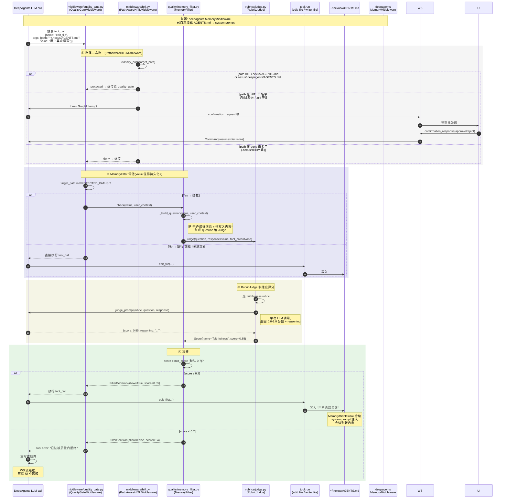

# 长期记忆写入时序图

> **场景**: LLM 决定"记住用户偏好 X",调用 `edit_file` / `write_file` 工具写入 `~/.nexus/AGENTS.md`,途中被 `QualityGateMiddleware` + `MemoryFilter` 拦截做 faithfulness 评分。
> **入口**: `nexus/backend/middleware/quality_gate.py::QualityGateMiddleware.awrap_tool_call`
> **下游**: `nexus/backend/quality/memory_filter.py::MemoryFilter.check` → `nexus/backend/rubrics/judge.py::RubricJudge.judge`

## 1. 完整时序



## 2. 关键边界 / 异常路径

| 场景 | 行为 | 代码位置 |
|------|------|---------|
| Judge 调用异常(超时 / 解析失败) | **默认放行** `allow=True`(`score=1.0`) | `memory_filter.py::check` line 129-135 |
| Judge 返回空 scores 列表 | 默认放行 | `memory_filter.py` line 142-147 |
| `bypass=True` 调用 | 直接放行,标记 `bypassed=True`(已有高 confidence 记忆更新) | `memory_filter.py` line 104-110 |
| `user_context` 缺失 | 退回旧版写死文案"`[记忆评估]`"行为兼容 | `_build_question` line 173-182 |
| 写入路径不在 PROTECTED_PATHS | 不走 quality_gate,交给 hitl 决定 | `quality_gate.py` 不拦截 |
| HITL 路径(项目源码) | 弹 confirmation_request,不走 quality_gate | `hitl.py::PathAwareHITLMiddleware` |
| deny 白名单(`.nexus/skills/*`) | 直接放行 | `hitl.py` 三态路由 |
| score < 0.7 但用户明确要求"记住这个" | 仍可能被拒(LLM 看到 tool error 后需要重写) | filter 忠实地按 faithfulness 评估 |
| AGENTS.md 是受保护文件 | 任何 LLM 写入必经此路径,无法绕过 | PathAwareHITLMiddleware + QualityGateMiddleware 串联 |

## 3. 设计要点

### 3.1 为什么走 middleware 不走 permissions?

deepagents 0.5.3 的 `permissions` 写入 `mode="interrupt"` **被静默忽略**(framework bug),导致 5 个 E2E 场景 FAIL。Middleware 是 framework-stable 钩子,跨版本兼容。

### 3.2 为什么默认放行(异常路径)?

**避免主流程因为评分服务不可用而崩**。`memory_filter.py::check` 注释明确写:"filter 自身异常(Judge 全失败 / 超时)→ 默认放行(allow=True)"。

### 3.3 为什么需要 user_context?

旧版 question 写死 "`[记忆评估]` 这条内容是否值得作为长期记忆持久化?"。当用户明确要求"帮我记下 e2e_hitl_marker_2026" 时,Judge 看到的是"用户问 / 助手回一个标记串",faithfulness 直接 0.0,工具被拒,WS 流提前结束,前端 HITL 批准后气泡空白。

`user_context` 把"用户最近消息摘要"塞给 Judge,让 Judge 理解"用户明确要求写入这个",`score=1.0`,放行。

### 3.4 三态路由 vs 二态路由

```python
# 旧(只考虑 protected/HITL 二态,deny 漏判)
class OldHITLMiddleware:
    def classify(path):
        if path in PROTECTED: return "protected"
        return "hitl"  # 所有非 protected 都弹窗 → 太烦

# 新(三态: protected / HITL / deny)
class PathAwareHITLMiddleware:
    def classify(path):
        if path in PROTECTED: return "protected"   # AGENTS.md → 走 quality_gate
        if path in DENY: return "deny"             # .nexus/skills/* → 直接放行
        return "hitl"                              # 项目源码 → 弹窗
```

## 4. 关键源码文件

| 层 | 文件 | 职责 |
|----|------|------|
| 拦截器 | `nexus/backend/quality/middleware.py` | `QualityGateMiddleware.awrap_tool_call` |
| 评分器 | `nexus/backend/quality/memory_filter.py` | `MemoryFilter.check` + `_build_question` + `_decide` |
| 评估器 | `nexus/backend/rubrics/judge.py` | `RubricJudge.judge` 单维度评分 |
| Rubric 定义 | `nexus/backend/rubrics/schemas.py` | `FAITHFULNESS_RUBRIC` 等 |
| 路径路由 | `nexus/backend/middleware/hitl.py` | `PathAwareHITLMiddleware.wrap_tool_call` |
| 工具执行 | `nexus/backend/tools.py` | `edit_file` / `write_file` 实现 |
| 记忆加载 | deepagents `MemoryMiddleware` | 自动读 2 份 AGENTS.md 注入 system prompt |
| AGENTS.md 路径 | `nexus/backend/agent/_system_prompt.py` | `make_memory_paths()` 返回用户级 + 项目级 |
| 用户级 AGENTS.md | `~/.nexus/AGENTS.md` | 真实文件路径 |
| 项目级 AGENTS.md | `nexus/.deepagents/AGENTS.md` | 真实文件路径,禁手编 |

## 5. 写入失败的可观察信号

| 现象 | 原因 |
|------|------|
| 日志 `MemoryFilter 评估异常,默认放行` | Judge 不可用 |
| 日志 `score 0.x < 0.7:<reasoning>` | 拦截,LLM 收到 tool error |
| 日志 `FilterDecision(bypassed=True)` | 显式豁免路径(已 bypass=True 调用) |
| 日志 `score 0.x ≥ 0.7` | 放行 |
| 前端 UI 无感知 | 拦截发生在 LLM 内部,WS 流照常继续 |
| `quality_scores` 表 | 该路径不写 quality_scores(quality_scores 是给回复打分,不是给工具调用打分) |

## 6. 相关测试

- `tests/test_memory_filter.py`(40 测) — MemoryFilter 各路径(bypass / 异常 / 通过 / 拒绝)
- `tests/test_force_tool_middleware.py`(22 测)
- `tests/test_dynamic_identity_middleware.py`(25 测)
- `tests/test_deepagents_integration.py`(35 测) — middleware 链集成
---

## 7. 相关文档

- [architecture.md §3.3](../architecture.md#33-长期记忆写入--质量门路径) — 概览
- [SPEC.md §中间件链](../SPEC.md) — middleware 顺序与各 hook 职责
