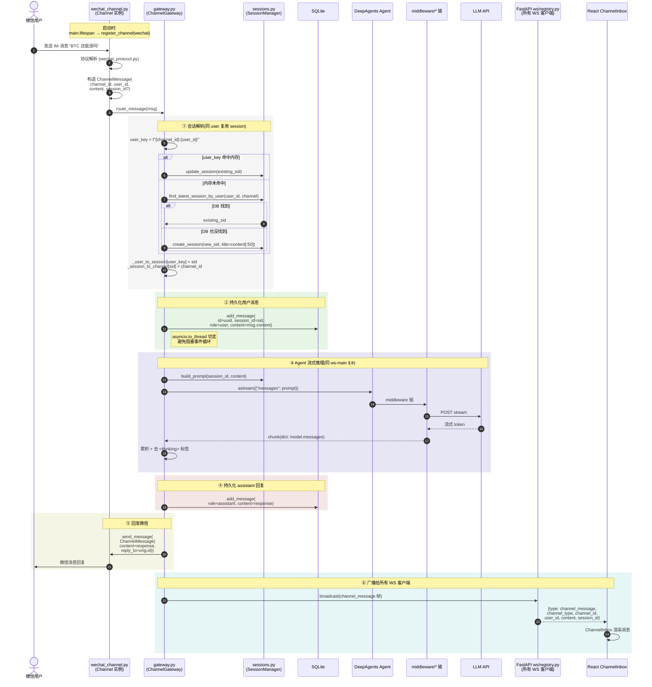

# 微信通道时序图

> **场景**: 微信用户给配置好的微信账号发消息,后端 Agent 处理后通过微信回发,并把消息广播到所有 WS 客户端(前端"通道消息"面板)。
> **入口**: `nexus/backend/channels/wechat_channel.py`(Channel 实例),中央路由 `nexus/backend/channels/gateway.py::route_message`
> **关联时序**: Agent 处理部分同 [ws-main.md](./ws-main.md)

## 1. 完整时序

## 2. 关键边界 / 异常路径

| 场景 | 行为 | 处理位置 |
|------|------|---------|
| `msg.content` 为空 | `logger.warning`,直接 return | `gateway.py::route_message` line 113 |
| `_call_agent` 抛异常 | catch → `_send_error(msg, str(e))` | gateway.py line 124-127 |
| `add_message` 失败 | `logger.error` 不中断(用户消息/助手回复分开 catch) | `_safe_add_message` line 236 |
| `send_message` 失败 | `logger.error` 不中断主流程 | gateway.py line 139 |
| `broadcast` 失败 | `logger.warning` 不中断(广播是 best-effort) | gateway.py line 146 |
| `route_message` 顶层异常 | catch-all → `_send_error` → 若 send_error 也失败记日志 | gateway.py line 149-154 |
| Gateway 重启后 user→session 映射丢 | `find_latest_session_by_user` 从 DB 查最近会话重建 | db.py line 267-288 |
| `update_session` 失败(异常) | catch,继续走 `find_latest_session_by_user` fallback | gateway.py line 163-167 |
| 同一 user 同一 channel 多次发 | `_user_to_session[user_key]` 命中 → 复用 sid,`update_session` 刷 updated_at | gateway.py line 158-162 |
| 多 account 并发 user_id 冲突 | `user_key` 包含 `channel_id` 前缀,天然隔离 | gateway.py line 157 |

## 3. 锁与并发

- `_lock: asyncio.Lock` 包 `_get_or_create_session`,**避免同一 channel_id 下并发请求创建两个 session**(实测 race 触发过 E2E fail)
- `asyncio.to_thread(self._messages.add_message, ...)`:db.add_message 是同步阻塞 IO,切到默认 executor 避免卡事件循环
- `EventSink._write` 自带 `threading.Lock`:LangChain callback 多线程并发,JSONL 行写不能交错

## 4. 关键源码文件

| 层 | 文件 | 职责 |
|----|------|------|
| Channel 基类 | `nexus/backend/channels/base.py` | Channel ABC + ChannelMessage dataclass |
| 中央路由 | `nexus/backend/channels/gateway.py` | route_message / 持久化 / 广播 |
| 注册表 | `nexus/backend/channels/registry.py` | 动态 Channel 实例管理 |
| 微信协议 | `nexus/backend/channels/wechat_protocol.py` | 微信推送 payload → ChannelMessage |
| 微信主循环 | `nexus/backend/channels/wechat_channel.py` | Channel.run() 协程 |
| 微信账号 | `nexus/backend/channels/wechat_account.py` | 账号 CRUD + 加密存储 |
| 微信登录 | `nexus/backend/channels/wechat_login.py` | 二维码扫码登录流程 |
| 微信 API | `nexus/backend/channels/wechat_api.py` | 调用微信开放接口 |
| 微信状态 | `nexus/backend/channels/wechat_state.py` | 登录状态机 |
| 微信 token | `nexus/backend/channels/wechat_tokens.py` | access_token 刷新 + context_token 管理 |
| 微信类型 | `nexus/backend/channels/wechat_types.py` | 协议常量 / 枚举 |
| WS 注册 | `nexus/backend/api/ws/registry.py` | `set_broadcast(ch_type, fn)` 入口 |
| WS 帧转换 | `nexus/backend/main.py::_build_broadcast_to_ws` | ChannelMessage → channel_message JSON 帧 |

## 5. 与 WS 主路径的差异

| 维度 | WS 主路径 | 微信通道 |
|------|-----------|---------|
| 触发方 | React 前端用户 | 微信用户(IM 推送) |
| 会话标识 | 客户端传 `session_id` 或新建 | gateway 按 `channel_id:user_id` 内存或 DB 查 |
| 消息回发 | 推 WS 帧给前端 | 调 `channel.send_message` 回微信 |
| 持久化 | ws/finalize.py 调 add_message | gateway._safe_add_message |
| 广播 | 不需要(单一客户端) | 广播给所有 WS 客户端 |
| 流式 UI | 前端实时渲染 thinking/chunk | 不流式给微信(IM 协议限制),只在最终回复 |
| Agent 异常 | 推 `error` 帧 | 调 `_send_error` 走微信 |

## 6. 扩展点(预留)

| 通道 | 入口文件 | 状态 |
|------|---------|------|
| WeChat | `channels/wechat_*.py` | ✅ 已实现 |
| Feishu | (预留) | 🚧 未实现 |
| Telegram | (预留) | 🚧 未实现 |

实现新通道 = 继承 `Channel` 基类 + 实现 `start/stop/send_message`,在 `main.py` lifespan 中 `register_channel(MyChannel())`。Gateway 路由逻辑无需改动。
---

## 7. 相关文档

- [architecture.md §3.2](../architecture.md#32-微信通道--im-消息异步路径) — 概览
- [ws-main.md](./ws-main.md) §④ Agent 流式推理(微信通道复用)
