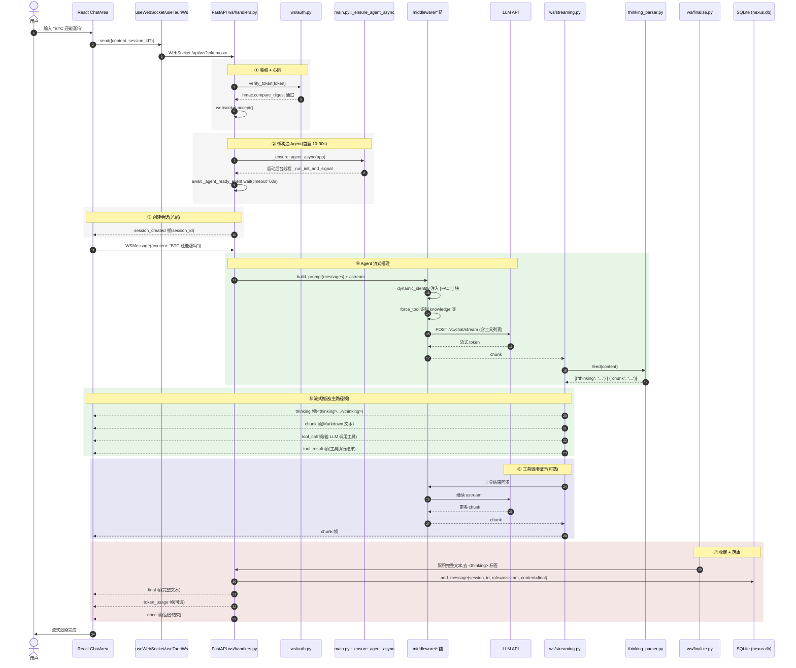

# WS 主路径时序图

> **场景**: 用户在 React 前端 ChatArea 发送一条消息,后端 Agent 流式响应,前端实时渲染,最终落库。
> **入口**: `frontend/src/hooks/useWebSocket.ts`(dev)或 `useTauriWs.ts`(DMG,Rust relay)
> **后端入口**: `nexus/backend/api/ws/handlers.py::handle_websocket`

## 1. 完整时序



## 2. 关键边界 / 异常路径

| 场景 | 行为 | 帧类型 |
|------|------|--------|
| Token 错误 / 缺失 | `websocket.close(code=4001, reason="未授权")` | (无帧) |
| Agent 懒构造 60s 超时 | 走 `agent_unavailable` 错误路径,不阻塞握手 | `error` |
| LLM 流中断 | `resilience/stream_guard.py` 按 `policies.retry` 重试 N 次 | 期间不推送帧,重试成功后继续 chunk |
| LLM 完全失败(重试用尽) | 推 `error` 帧,`error_code=llm_unavailable` | `error` |
| 用户输入触发澄清 | Agent 调 `ask_user` 工具 → 中断 astream → WS 推澄清帧 → 前端弹窗 | `clarification_request` |
| Agent 要写文件触发 HITL | `middleware/hitl.py::PathAwareHITLMiddleware` 抛 `GraphInterrupt` → 转 `confirmation_request` 帧 → 前端按钮 → 回 `confirmation_response` 帧 → `Command(resume=...)` 续流 | `confirmation_request` / `confirmation_response` |
| WS 断开后重连 | 客户端带 `resume_token` query → `ws/auth.py` 校验 → `ws/resume.py` 从 `resume_tokens.last_event_id` 续推 | `resume_ack` + 重放 |
| resume_token 失效 | 推 `invalid_resume_token` 帧,客户端需建新会话 | `invalid_resume_token` |

## 3. 帧序列约定

完整 18 种帧定义见 `frontend/src/types/index.ts::StreamEvent union`。

主路径顺序(成功):
```
session_created → thinking* → chunk* → (tool_call → tool_result → chunk*)* → final → done
```

辅帧(可能穿插):
- `token_usage` — 在 done 前或长流中
- `stats` — 失败/降级时携带 `retries` / `fallbacks` / `events_emitted`
- `error` — 终态,不会再发后续帧

## 4. 关键源码文件

| 层 | 文件 | 职责 |
|----|------|------|
| 前端 hook | `frontend/src/hooks/useWebSocket.ts` | 浏览器 dev 模式直连 WS |
| 前端 hook | `frontend/src/hooks/useTauriWs.ts` | Tauri DMG 模式(Rust relay 转发) |
| 鉴权 | `nexus/backend/api/ws/auth.py` | `hmac.compare_digest` + 心跳 |
| 业务编排 | `nexus/backend/api/ws/handlers.py` | `handle_websocket` 主循环 |
| 流式 | `nexus/backend/api/ws/streaming.py` | chunk / thinking / tool_call 帧生成 |
| 状态机 | `nexus/backend/api/thinking_parser.py` | `<thinking>` 标签跨 chunk 边界处理 |
| 收尾 | `nexus/backend/api/ws/finalize.py` | final / done 帧 + add_message 持久化 |
| 落库 | `nexus/backend/db.py::add_message` | SQLite 写 messages 表 + 更新 sessions.updated_at |
| 中间件 | `nexus/backend/middleware/*.py` | dynamic_identity / force_tool / hitl 链 |
| 韧性 | `nexus/backend/resilience/stream_guard.py` | 流式重试 |
| 续传 | `nexus/backend/resilience/resume.py` | resume_token HMAC + 续推 |

## 5. 性能 / 资源要点

- **Agent 懒构造**: 首条消息才有 10-30s 等待,后续消息几乎 0 延迟
- **busy_timeout=30s**: db.py 启用,抗 aiosqlite 写锁等待
- **StreamGuard**: 单 chunk ≤ N ms,长 chunk 拆分推送避免前端卡顿
- **thinking_parser**: hold partial 标签,flush 时兜底,确保不丢字
- **token_usage 帧**: 长对话触发(>8K tokens),提示用户即将超限
---

## 6. 相关文档

- [architecture.md §3.1](../architecture.md#31-ws-主路径--用户在-react-ui-发消息) — 概览
- [SPEC.md §WebSocket](../SPEC.md) — 完整 18 种帧定义 + ws/ 包结构
- [wechat-channel.md](./wechat-channel.md) — Agent 处理部分复用本图 §④
